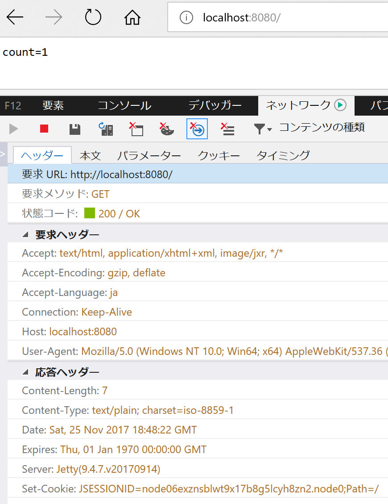
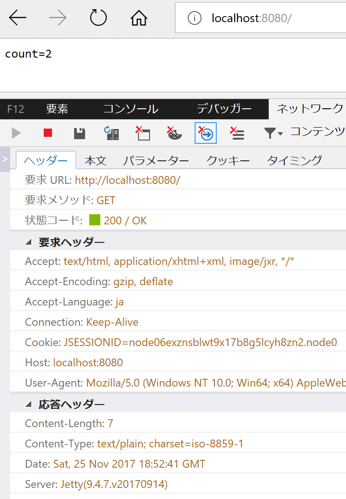
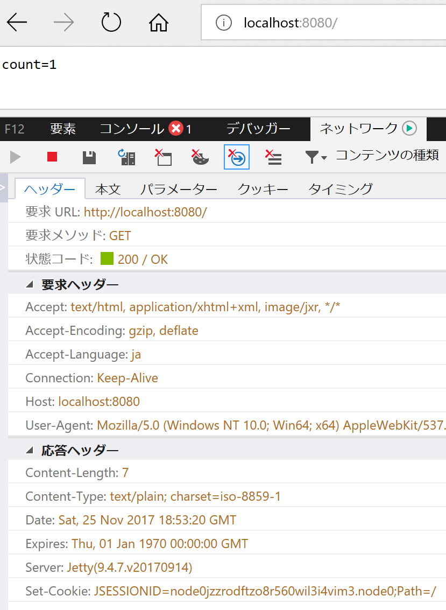
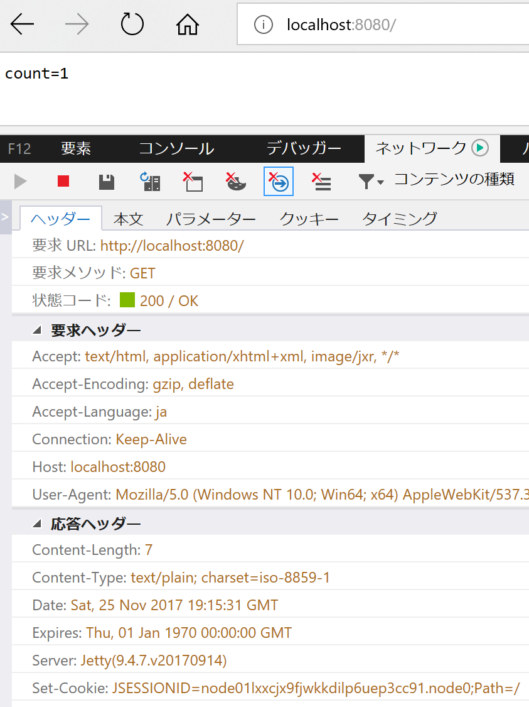
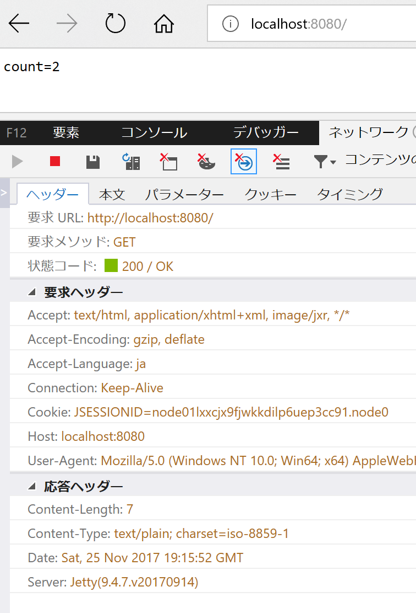
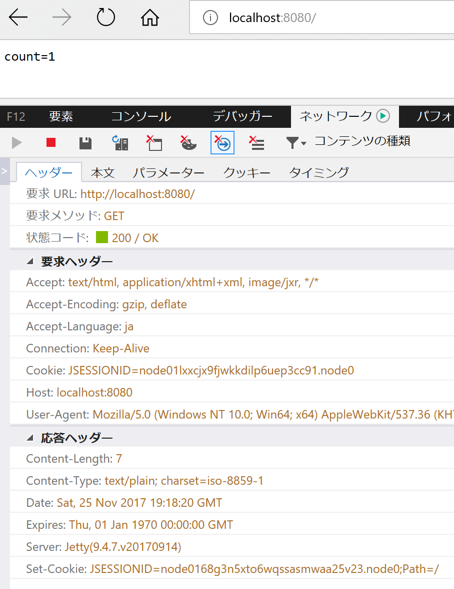
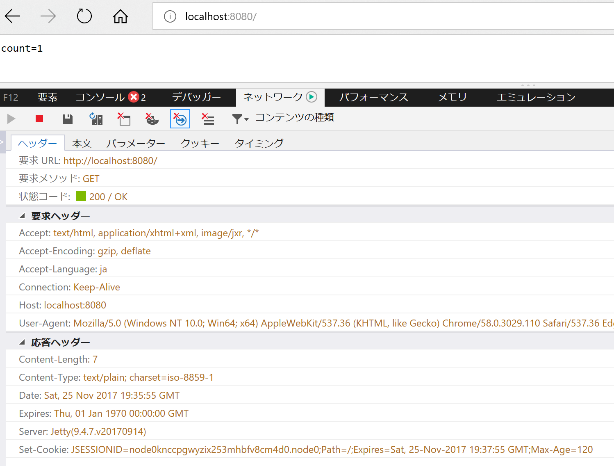
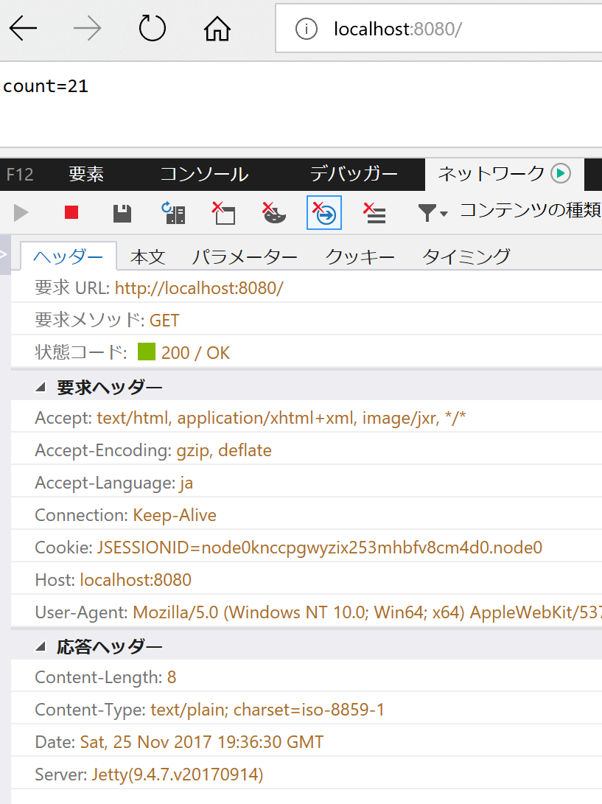
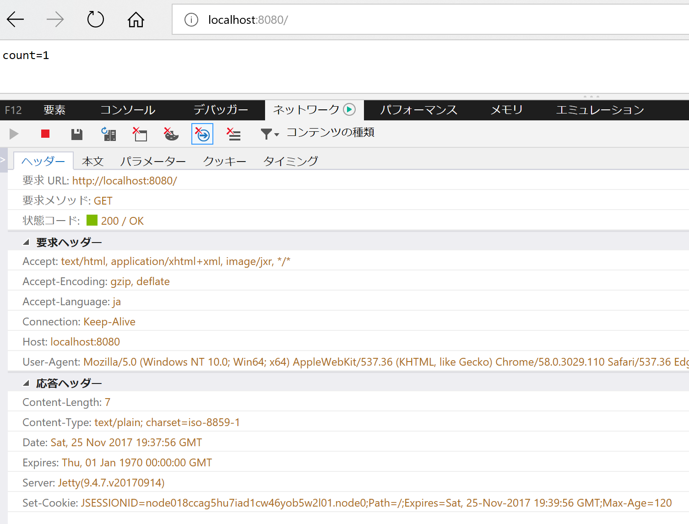

# sample-http-session

[](https://github.com/u6k/sample-http-session/releases)
[](https://github.com/u6k/sample-http-session/blob/master/LICENSE)

> ServletのHttpSessionを使うサンプル

__Table of Contents:__

<!-- TOC depthFrom:2 -->

- [Install](#install)
- [Usage](#usage)
    - [セッション・タイムアウトを何も設定しない場合](#セッション・タイムアウトを何も設定しない場合)
    - [セッション・タイムアウトを設定した場合](#セッション・タイムアウトを設定した場合)
    - [Cookie寿命を設定した場合](#cookie寿命を設定した場合)
- [Maintainer](#maintainer)
- [Contribute](#contribute)
- [License](#license)

<!-- /TOC -->

## Install

次のコマンドでWebアプリケーションを起動します。

```
$ ./mvnw jetty:run
```

[http://localhost:8080/](http://localhost:8080/)にアクセスすると、カウントが表示されます。

## Usage

セッション・タイムアウトやCookie有効期限の設定と、通信の挙動の関係を調べます。

### セッション・タイムアウトを何も設定しない場合

セッション・タイムアウトは`src/main/webapp/WEB-INF/web.xml`の`<session-timeout>`で設定しますが、まずは`web.xml`を削除してデフォルトの挙動を確認してみます。

Webブラウザを開いて[http://localhost:8080/](http://localhost:8080/)にアクセスすると、`count=1`が表示されます。この時、レスポンスに`Set-Cookie`に`JSESSIONID`が設定されます。`Expires`や`Max-Age`が未設定なので、この`JSESSIONID`はWebブラウザを閉じたときにWebブラウザから削除されます。



次にアクセスすると、`count=2`が表示されます。この時、リクエストに先ほどの`JSESSIONID`が設定されています。この`JSESSIONID`により先ほどと同一セッションと判定されて、サーバー側でカウントアップ処理が行われます。



Webブラウザを閉じてアクセスすると、`count=1`が表示されます。この時、リクエストには`JSESSIONID`が設定されておらず、レスポンスに`Set-Cookie`で新しい`JSESSIONID`が設定されます。上で説明した通り、Webブラウザを閉じたために`JSESSIONID`がWebブラウザから削除され、このような挙動になります。



なお、Webアプリケーション側はセッションを無期限で保持します。

### セッション・タイムアウトを設定した場合

セッション・タイムアウトを1分に設定した時の挙動を確認してみます。

まず、`web.xml`を次のように修正します。

```
<session-config>
    <session-timeout>1</session-timeout>
</session-config>
```

`<session-timeout>`は、タイムアウト時間を分単位で設定します。

Webブラウザを開いて[http://localhost:8080/](http://localhost:8080/)にアクセスすると、先ほどと同様に`count=1`が表示されます。レスポンスも先ほどと同様に`Set-Cookie`で`JSESSIONID`が設定されており、`Expires`や`Max-Age`が未設定なのでWebブラウザを閉じたときに削除されます。



次に1分以内にアクセスすると、`count=2`が表示されます。同様にアクセスし続けると、カウントアップされ続けます。Webアプリケーション側のセッション・タイムアウト時刻は、アクセスするたびにリセットされます。



次に1分以上後にアクセスすると、`count=1`が表示されます。リクエストを見ると`JSESSIONID`が設定されていますが、レスポンスを見ると`Set-Cookie`でリクエストとは異なる`JSESSIONID`が設定されています。つまり、Webアプリケーション側でセッションが破棄され、新しいセッションが開始されたということです。



なお、1分以内にWebブラウザを閉じて再びアクセスしても`count=1`が表示されます。これは、Webブラウザを閉じたために`JSESSIONID`が削除されたためです。

### Cookie寿命を設定した場合

セッション・タイムアウトを1分、Cookie寿命を2分に設定した時の挙動を確認してみます。

まず、`web.xml`を次のように修正します。

```
<session-config>
    <session-timeout>1</session-timeout>
    <cookie-config>
        <max-age>120</max-age>
    </cookie-config>
</session-config>
```

`<cookie-config>/<max-age>`は、Cookie寿命を秒単位で設定します。これを設定することで、`Set-Cookie`に`Expires`と`Max-Age`が設定されるようになります。

セッション・タイムアウトは、Webアプリケーションにアクセスするごとにタイムアウト時刻が更新されます。これに対してCookie寿命は、最初に`Set-Cookie`されたときに設定されそのあとは更新されないために、寿命の時刻が来るとWebブラウザから削除されます。`Set-Cookie`に`Expires`と`Max-Age`が設定されるためにWebブラウザを閉じても削除されないため、Webブラウザのライフサイクルをまたいでセッションを保持することができます。

実際の挙動を確認してみます。Webブラウザを開いて[http://localhost:8080/](http://localhost:8080/)にアクセスすると、これまでと同様に`count=1`が表示されます。レスポンスに`Set-Cookie`で`JSESSIONID`が設定されますが、先ほどと異なり`Expires`と`Max-Age`が設定されます。



1分以内に同様にアクセスすると、カウントアップされ続けます。



Webブラウザを更新し続けていると、最初のアクセスから2分経過後に`count=1`に戻ります。リクエストを見るとそれまで設定されていた`JSESSIONID`が設定されておらず、リクエストに`JSESSIONID`がないのでレスポンスの`Set-Cookie`で新しい`JSESSIONID`が設定されます。



なお、1分以内にWebブラウザを閉じて再びアクセスした場合、閉じる前のセッションが保持されているためにカウントアップが継続されます。

## Maintainer

- u6k
    - [u6k.Blog()](https://blog.u6k.me/)
    - [u6k | GitHub](https://github.com/u6k)
    - [@u6k_yu1 | Twitter](https://twitter.com/u6k_yu1)

## Contribute

興味を持っていただき、ありがとうございます。当リポジトリについてご連絡がある場合、Issueを作成してください。作成者にご連絡がある場合、Maintainerセクションのいずれかにご連絡ください。

## License

[MIT License](https://github.com/u6k/sample-http-session/blob/master/LICENSE)
